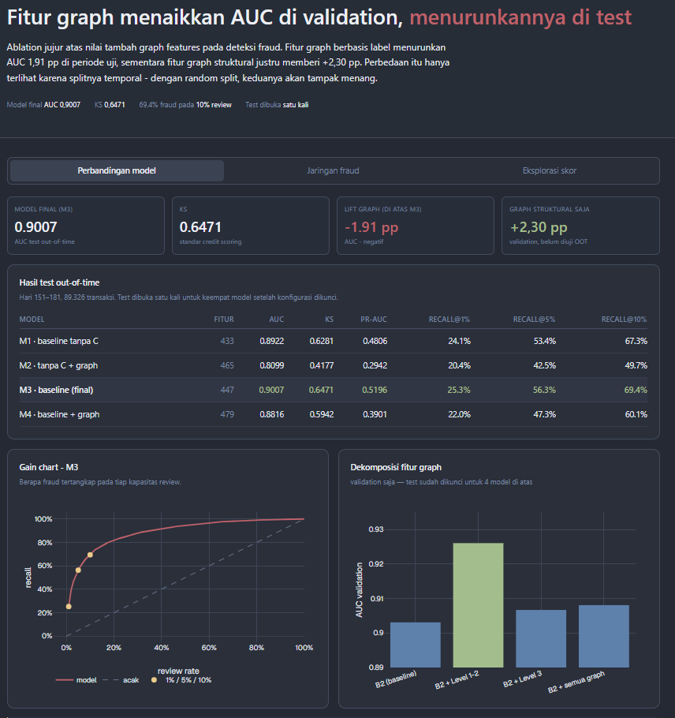
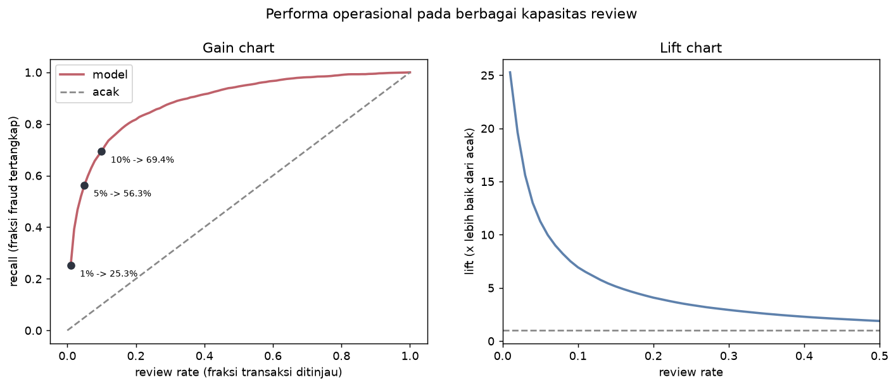
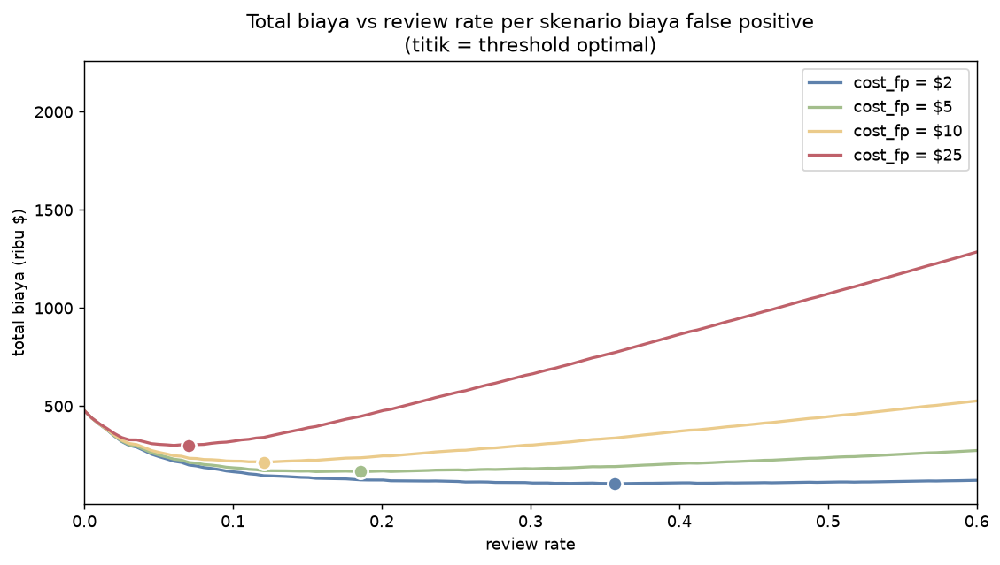

# Graph-Based Fraud Risk Model - IEEE-CIS

**Fitur graph berbasis label menaikkan AUC di validation dan menurunkannya 1,91 pp
di test out-of-time. Fitur graph struktural justru memberi +2,30 pp. Perbedaannya
hanya terlihat karena splitnya temporal.**

Ablation jujur atas 590.540 transaksi IEEE-CIS (Vesta), dengan validasi
out-of-time dan test set yang dibuka tepat satu kali.



*Dashboard interaktif: perbandingan model, eksplorasi jaringan fraud, dan simulasi
ambang skor dengan trade-off biaya. [Cara menjalankan](#dashboard).*

---

## Temuan utama

| | AUC | KS | PR-AUC | recall@1% | recall@10% |
|---|---|---|---|---|---|
| **M3 - baseline (model final)** | **0,9007** | **0,6471** | **0,5196** | **25,3%** | **69,4%** |
| M1 - baseline tanpa C-features | 0,8922 | 0,6281 | 0,4806 | 24,1% | 67,3% |
| M4 - baseline + graph | 0,8816 | 0,5942 | 0,3901 | 22,0% | 60,1% |
| M2 - tanpa C + graph | 0,8100 | 0,4177 | 0,2942 | 20,4% | 49,7% |

Semua angka di atas dari **test set out-of-time** (hari 151–181), bukan validation.

Tiga hal yang membuat hasil ini menarik:

**1. Graph features menurunkan performa - tapi tidak seluruhnya.**
Dekomposisi memisahkan dua jenis fitur graph yang perilakunya berlawanan:

| Feature set (validation) | AUC | KS | vs baseline |
|---|---|---|---|
| B2 baseline | 0,9031 | 0,6435 | - |
| **B2 + graph struktural (Level 1–2)** | **0,9261** | **0,7096** | **+2,30 pp** |
| B2 + graph berbasis label (Level 3) | 0,9067 | 0,6557 | +0,36 pp |
| B2 + semua graph | 0,9081 | 0,6630 | +0,50 pp |

Fitur struktural - degree, PageRank, ukuran komponen - memberi lift substansial.
Fitur berbasis label - neighbor fraud rate, UID fraud rate - merusak generalisasi
dan menyeret yang baik turun bersamanya.

**2. Model justru paling mengandalkan fitur yang merusak.**
SHAP pada M4 menempatkan empat fitur berbasis label di peringkat 1–4, dengan
kontribusi 2–2,5 kali lebih besar daripada fitur non-graph terbaik. Semua tanda
menunjukkan keberhasilan - sampai test out-of-time dibuka.

**3. PSI punya titik buta.**
PSI skor train→test hanya 0,0032 (sangat stabil), tapi fitur berbasis label
sudah lumpuh: nilainya stabil (drift −2,8%) sementara **kekuatan buktinya runtuh
52%** (`uid_labeled_count` 6,00 → 2,87; 67,3% baris test tanpa tetangga berlabel).
Monitoring yang hanya memantau nilai fitur tidak akan menangkap kegagalan ini.



---

## Dampak bisnis

Model diterjemahkan ke keputusan operasional, bukan berhenti di AUC.

| Biaya review per transaksi | Review rate optimal | Fraud tertangkap | Penghematan/bulan | Reduksi biaya |
|---|---|---|---|---|
| $2 | 35,7% | 90,2% | $360.292 | 78,0% |
| **$5** | **18,6%** | **81,0%** | **$300.780** | **65,1%** |
| $10 | 12,1% | 73,7% | $255.332 | 55,3% |
| $25 | 7,0% | 63,1% | $172.239 | 37,3% |

Threshold optimal bergeser **lima kali lipat** hanya karena asumsi biaya berubah.
Karena itu deliverable-nya adalah alat untuk memilih threshold, bukan satu angka.



Scorecard 300–850 (PDO 20): band 10% terburuk menampung **69,4% seluruh fraud**
dengan fraud rate 24,2% - tujuh kali rata-rata populasi.

---

## Bagaimana saya mencegah leakage

Bagian ini yang paling menentukan validitas seluruh hasil.

**Split temporal, dipotong pada batas hari.**
Batas ditentukan indeks hari, bukan persentil baris. Persentil baris jatuh di
tengah hari, sehingga transaksi dari hari yang sama terbelah antar split - dan
agregasi harian akan membocorkan informasi lintas batas.

```
train : hari   0–118   410.601 baris   69,5%
gap   : hari 119–125    23.575 baris    4,0%   ← dibuang
val   : hari 126–150    67.038 baris   11,4%
test  : hari 151–181    89.326 baris   15,1%   ← sekali pakai
```

Gap 7 hari meniru delay pelaporan chargeback: saat model dilatih, label untuk
transaksi terbaru belum tersedia.

**Semua statistik di-fit hanya pada periode training.**
Frequency encoding, agregasi per entitas, label encoding - semuanya memakai
`is_train` sebagai mask. Kategori tak terlihat diperlakukan berbeda sesuai
maknanya: frequency → 0 (memang tidak pernah muncul), agregasi → NaN (tidak
diketahui, bukan nol), label → −1 (kategori tersendiri).

**Fitur berbasis label wajib menerima `label_mask`.**
Tidak ada nilai default - mustahil lupa memberikannya. Mask selalu periode
training, termasuk saat menghitung fitur untuk test.

**Leave-one-out terverifikasi terhadap perhitungan dense.**
Transaksi tidak boleh melihat labelnya sendiri lewat rata-rata tetangganya.
Kontribusi diri adalah diagonal `(A @ Aᵀ)[i,i]`, dihitung tanpa membentuk
matriksnya:

```python
loo_positive = A @ (A.T @ y_masked) - self_weight * y_masked
loo_labeled  = A @ (A.T @ mask)     - self_weight * mask
```

**Uji flip label pada data penuh.**
Membalik SELURUH label validation dan test pada 590.540 baris menghasilkan fitur
Level 3 yang **identik bit-per-bit**. Ini dijalankan pada dataset nyata, bukan
hanya toy graph.

**Test set dibuka satu kali.**
Empat model dievaluasi bersamaan setelah konfigurasi dikunci. Keputusan
menggugurkan fitur diambil dari SHAP di validation, sebelum test dibuka -
menggugurkan setelahnya akan menjadikan test alat seleksi. Audit trail:
`artifacts/experiments.csv` punya tepat 4 baris dengan `test_auc` terisi dari 9
baris eksperimen.

**Konsekuensi yang saya terima.** Dua kandidat peningkatan tidak terverifikasi
out-of-time karena test sudah dikunci: graph struktural (+2,30 pp) dan
`scale_pos_weight=5` + isotonic (+1,28 pp). Keduanya dilaporkan sebagai hipotesis
untuk pekerjaan lanjutan, bukan sebagai klaim.

---

## Metodologi

```
data mentah (1,3 GB CSV)
  └─ join transaction + identity, dtype reduction  →  merged.parquet (80 MB)
      └─ temporal split per batas hari             →  split_masks.parquet
          ├─ fitur tabular (447 kolom)             →  baseline.parquet
          └─ bipartite graph 590K × 15.995         →  graph_level12/level3.parquet
              └─ ablation 4 model                  →  experiments.csv
                  └─ evaluasi risk-style           →  scorecard, PSI, biaya, kalibrasi
```

**Graph.** Bipartite transaksi–atribut dari 7 kolom (`card1`, `addr1`,
`DeviceInfo`, `P_emaildomain`, `R_emaildomain`, `id_30`, `id_31`). Adjacency
transaksi-ke-transaksi **tidak pernah dimaterialisasi** - estimasinya 89,5 miliar
nnz. Semua agregasi lewat `A @ (Aᵀ @ v)`, biaya linier terhadap nnz(A) = 2,08 juta.

`card3`/`card4`/`card6`/`addr2`/`DeviceType` sengaja dikecualikan: satu nilai
menampung 65–88% baris, sebagai node akan menghubungkan hampir semua transaksi.
Atribut berdegree > 5.000 (termasuk gmail.com dengan 228K transaksi) dikeluarkan
dari propagasi tetangga tapi tetap dipakai sebagai fitur degree.

**Model.** XGBoost, `scale_pos_weight=1,0`, early stopping pada validation
temporal. Backend XGBoost dipilih karena binary LightGBM crash di mesin
pengembangan; metodologi tidak terpengaruh - MASTER_PLAN sudah mencantumkan
XGBoost sebagai pembanding, dan NaN handling native-nya setara.

---

## Limitasi

- **Dua kandidat peningkatan belum terverifikasi OOT** (lihat di atas). Ini biaya
  yang dibayar demi disiplin test-sekali-pakai.
- **Definisi UID bergantung pada `D1`.** Kombinasi `card1`+`addr1`+`D1n`
  menghasilkan 96,6% homogenitas label pada UID multi-transaksi - bukti entitas
  nyata - tapi coverage train→test hanya 33,9% baris.
- **`uid_size` dihitung atas seluruh periode**, menyebabkan drift +250,8%.
  Kesalahan desain yang ditemukan saat investigasi Fase 4: aturan yang benar
  adalah semua agregasi, termasuk yang tidak menyentuh label, harus dihitung dari
  periode training saja.
- **Biaya false positive adalah asumsi**, bukan angka terukur. Karena itu
  disajikan sebagai sensitivitas.
- **Biaya reputasi dan churn tidak dimodelkan.**
- **Fraud rate tidak stabil** - 2,07% (minggu 3) hingga 5,07% (minggu 16), rasio
  2,45×. Model yang dilatih pada periode awal akan under-predict di periode
  berikutnya.
- **GNN tidak dikerjakan.** GBDT + graph features yang bersih dinilai lebih
  bernilai daripada GNN tanpa framing.

---

## Cara menjalankan

```bash
git clone <repo>
cd graph-fraud-risk

python -m venv venv
./venv/Scripts/pip install -e ".[dev]"    # Windows
# source venv/bin/activate && pip install -e ".[dev]"   # Linux/macOS

# Letakkan data Kaggle IEEE-CIS di data/raw/
# kaggle competitions download -c ieee-fraud-detection

make data       # join + dtype reduction  → data/interim/merged.parquet
make split      # temporal split          → data/interim/split_masks.parquet
make eda        # figur EDA               → reports/figures/
make features   # feature matrix tabular  → data/features/baseline.parquet
make train-all  # latih kedua baseline
make test       # 79 unit test
```

Fase graph dan evaluasi:

```bash
./venv/Scripts/python -m src.graph.pipeline          # fitur graph Level 1–2
./venv/Scripts/python -m src.graph.level3_pipeline   # fitur Level 3
./venv/Scripts/python -m src.models.ablation         # ablation 4 model
./venv/Scripts/python -m src.evaluation.phase5       # scorecard, PSI, biaya, kalibrasi
```

---

## Struktur repo

```
configs/          YAML - semua path & hyperparameter, tidak ada hardcode
src/
  data/           load, dtype reduction, temporal split, profiling
  features/       encoder train-fitted (frequency, aggregation, label)
  graph/          bipartite sparse, fitur Level 1–2, Level 3 + label_mask
  models/         training, ablation, experiment tracker
  evaluation/     metrics, scorecard, stability, business, calibration
  viz/            figur & precompute dashboard
tests/            79 test - fokus anti-leakage
reports/
  decisions.md    catatan keputusan per fase (bahan mentah artikel)
  model_card.md   asumsi, limitasi, kapan model tidak boleh dipakai
  executive_summary.md
  figures/
dashboard/        Next.js - model comparison, network explorer, score explorer
```

## Dashboard

Next.js 16 + Plotly, static export - tidak butuh server saat runtime.

```bash
cd dashboard
npm install
npm run dev     # http://localhost:3000
npm run build   # static export ke dashboard/out/
```

Tiga tab: perbandingan model dengan gain chart, eksplorasi jaringan fraud
(27 subgraph pra-layout), dan eksplorasi skor dengan slider ambang yang langsung
menghitung ulang review rate, recall, dan penghematan.

Data dashboard di-precompute ke `dashboard/public/data/*.json` (912 KB) dan
ter-commit, sehingga dashboard jalan langsung setelah `git clone` tanpa perlu
menjalankan ulang pipeline. Regenerasi:

```bash
./venv/Scripts/python -m src.viz.export_dashboard_data
```

Deploy ke Vercel: connect repo, set root directory ke `dashboard`.

## Dokumen

- [Catatan keputusan](reports/decisions.md) - setiap keputusan metodologis beserta alasannya
- [Model card](reports/model_card.md) - asumsi, limitasi, batas penggunaan
- [Executive summary](reports/executive_summary.md) - satu halaman untuk non-teknis
